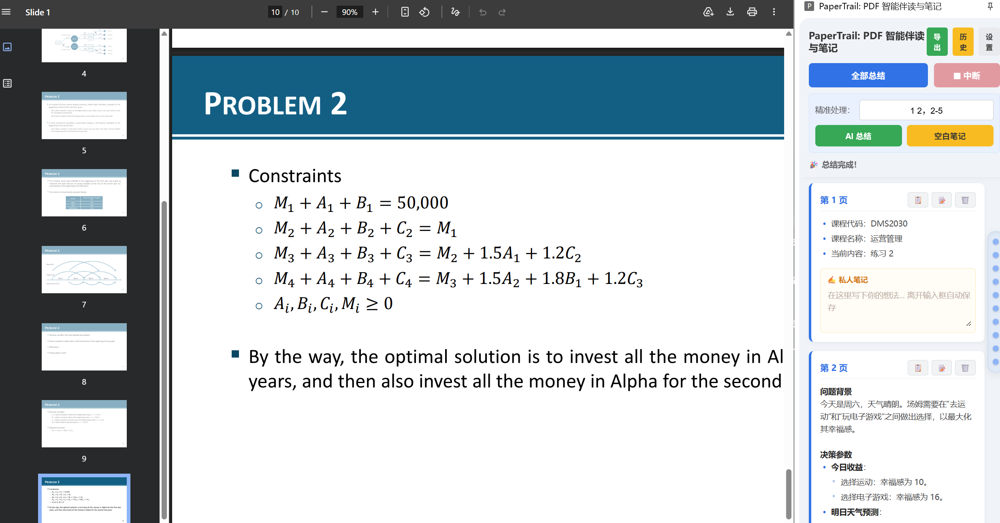
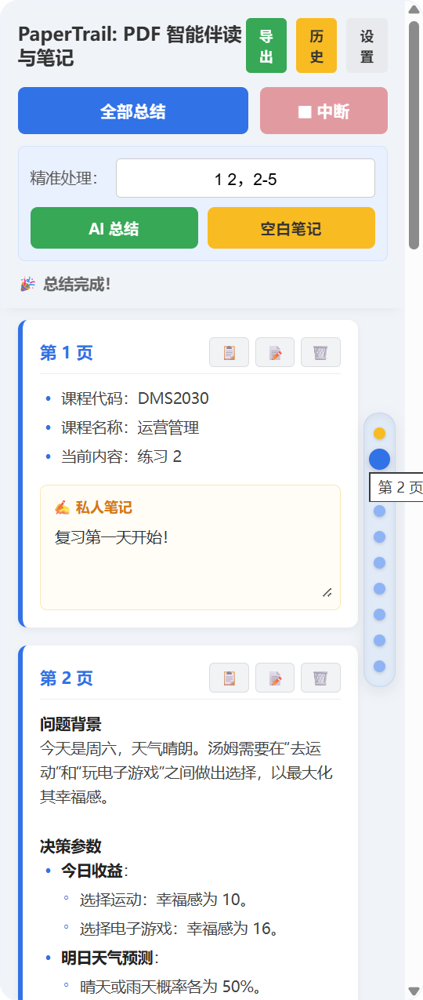
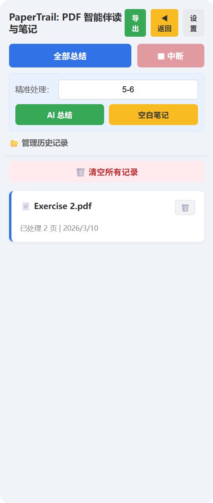
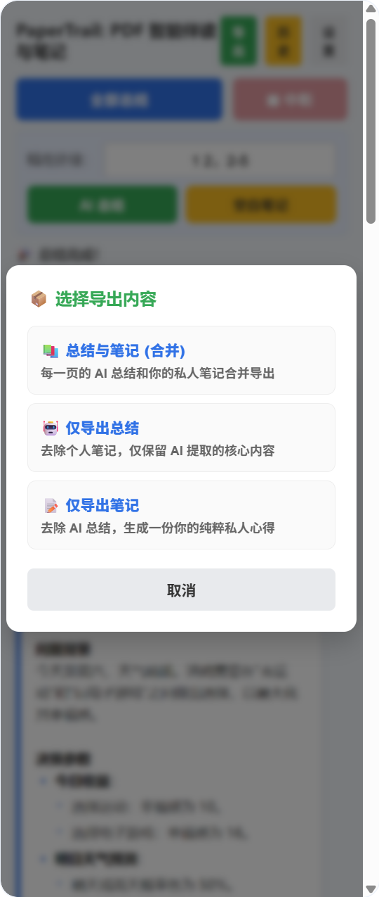

# 📑 PaperTrail: PDF 智能伴读与笔记

  

 

一款专注“逐页精读”与“知识沉淀”的 Chrome 侧边栏 AI 扩展。

面对动辄上百页的学术论文、行业报告或财报，传统的“全文一键总结”往往会遗漏关键数据，甚至产生严重的 AI 幻觉。PaperTrail 为此而生。它像一个耐心的学术助教，坐在你的浏览器右侧，陪你一页一页拆解硬核知识，并留下你专属的思想轨迹。

---

## ✨ 核心杀手锏 (Features)

### 🤖 1. 像素级的逐页提炼
拒绝囫囵吞枣！输入页码（如 `1, 3-5`），精准调用 DeepSeek / Qwen 等大模型对当前页进行提炼。剔除废话，直击核心，甚至在文字极少时自动降级为 OCR 助手，原汁原味提取图表标题。

### 📝 2. 双轨制沉浸批注
不打断心流的阅读体验。AI 总结在上方，你的私人笔记在下方。
* **无缝衔接**：随时点击 📝 按钮，在当前页展开专属的黄色笔记区。
* **防抖闪存**：无需点击保存，离开输入框瞬间自动存入本地，永不丢失。

### ⚡️ 3. 毫秒级冷启动与幽灵侧边栏
* **上下文感知**：侧边栏宛如幽灵，仅在打开 PDF 时现身，切到其他网页自动隐藏，把屏幕还给你。
* **乐观预加载 (Optimistic UI)**：二次打开文档时，历史记录 0 毫秒极速上墙，无需等待庞大的 PDF 文件重新下载。

### 📦 4. 知识沉淀闭环 (导出引擎)
内置大师级零依赖正则渲染引擎，优雅渲染 LaTeX 数学公式和 Markdown 列表。支持三种模式的一键导出：
* 📚 **总结与笔记 (合并)**：图文并茂的完整阅读档案。
* 🤖 **仅导出总结**：纯净的 AI 提炼干货。
* 📝 **仅导出笔记**：你个人的纯粹思想结晶。

### 🔐 5. BYOK 绝对隐私保护
本插件采用纯前端 Serverless 架构，没有任何居心叵测的后台服务器。
* **Bring Your Own Key**：将模型选择权交给用户。你的 API Key 仅加密保存在浏览器的本地缓存中。
* **数据不出域**：你的每一句私人笔记，都只存在于你自己的硬盘里。

---

## 🛠️ 安装指南 (Installation)

由于本扩展采用了极致的本地沙箱架构，您可以直接通过“开发者模式”进行免密安装：

1. 下载本项目的 `.zip` 压缩包，并解压到一个固定的文件夹中。
2. 打开 Chrome 浏览器，在地址栏输入：`chrome://extensions/` 并回车。
3. 开启页面右上角的 **“开发者模式”** 开关。
4. 点击左上角的 **“加载已解压的扩展程序”**，选择您刚刚解压的文件夹。
5. ⚠️ **极其重要**：如果您想在电脑本地的 PDF 文件上使用本插件，请在扩展管理页面点击本插件的“详细信息”，并打开 **“允许访问文件网址”** 开关。
6. 🎉 **成功！** 建议点击浏览器右上角的拼图 🧩 图标，将本插件 **固定 (Pin)** 到工具栏。

---

## 🚀 快速上手 (Quick Start)

1. **配置燃料**：首次使用，请点击侧边栏右上角的【⚙️ 设置】按钮，填入您的 ModelScope API Key，并选择您心仪的推理模型（推荐 `deepseek-ai/DeepSeek-V3.2`）。
2. **打开靶场**：在浏览器中打开任意在线或本地 PDF。
3. **开始沉淀**：
   * 输入 `1-10`，点击 【🚀 AI 总结】，去泡杯咖啡，回来看 AI 的表演。
   * 看到某一页有感而发？点击 【📝 空白笔记】，立刻开始挥洒灵感。

---

## 👨‍💻 技术栈 (Tech Stack)
* **核心驱动**: 原生 JavaScript (ES6+) / HTML5 / CSS3 (零第三方 UI 框架，极致轻量)
* **文档解析**: Mozilla PDF.js (Worker 隔离运行)
* **存储引擎**: Chrome Extension Storage API
* **AI 引擎**: 兼容 ModelScope 生态系统 (支持 DeepSeek, Qwen, GLM 等)

---
*“留下轨迹，沉淀知识。”* —— 祝您阅读愉快！